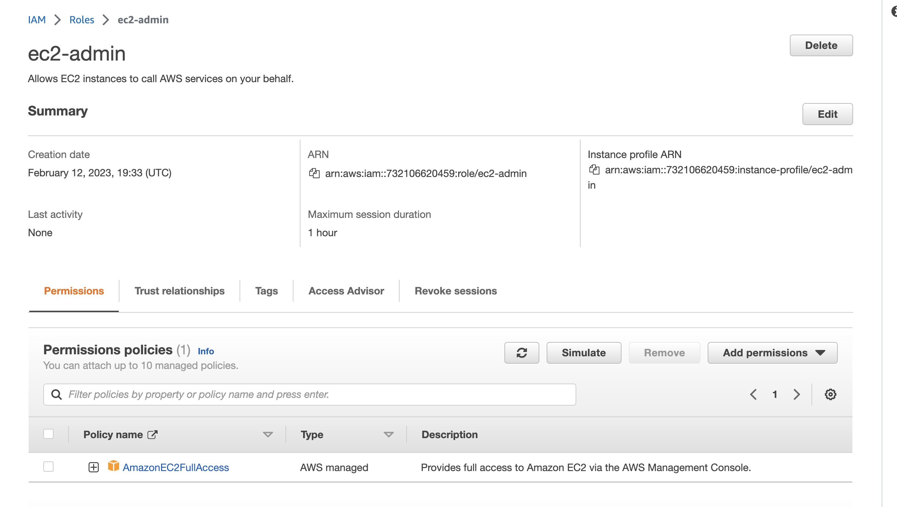

# Week 0 — Billing and Architecture

### Set a Billing alarm

Billing alarm helps in generating the notifications when the threshold of the budget will cross.

**How to start this?**

While creating the budgets enter the email address (you can set multiple).

[Billing Alarm](./assets/budget-alarm.png)

## Set a AWS Budget

We can set budgets based on cost and usage for daily, monthly, yearly etc.

We have a dedicated service in AWS to create the budget and set the budget. This helps in avoiding overspend.

## Generating AWS Credentials

When we create an account in AWS we are the root user. As a root user we can create more users too and grant them access.

**How?**

## In IAM service, we can click on "Add user" (optional can give access to AWS management console)

## Next, set permissions (add to existing groups, or attach policies)

## Review and create

Limited the privilages to the user:

## Using CloudShell 

## Conceptual Architecture Diagram or your Napkins

## Destroy your root account credentials, Set MFA
  
  

  

## Use EventBridge to hookup Health Dashboard to SNS and send notification when there is a service health issue.

## Review all the questions of each pillars in the Well Architected Tool (No specialized lens)

- Create an architectural diagram (to the best of your ability) the CI/CD logical pipeline in Lucid Charts

## Research the technical and service limits of specific services and how they could impact the technical path for technical flexibility.

The service is Dynamodb. 

[Here](https://docs.aws.amazon.com/amazondynamodb/latest/developerguide/ServiceQuotas.html#default-limits-throughput-capacity-modes) is limit of DynamoDB for provisioned DB, and read/write per account: 

1. 80,000 RCU

2. 80,000 WCU

When we want to add the content to the DB, we should calculate the limits of DynamoDB write (WCU - write capacity unit).

Reason is, this will guide us on:

1. Cost

2. If we have to request for more capacity

3. If we need to optimize the usage

## Open a support ticket and request a service limit

PS: I use an alias cloudgeeky and hellonehha is my secondary email. If you need proof I can share it :)

